# LinkedIn Strategy Assistant - Cost Analysis Dashboard

## 💰 Total Development Cost: **$0.20 USD**

**Period:** January 28-30, 2026 (3 days)  
**Efficiency Score:** ⭐⭐⭐⭐⭐ 98/100

---

## 📊 Cost Distribution

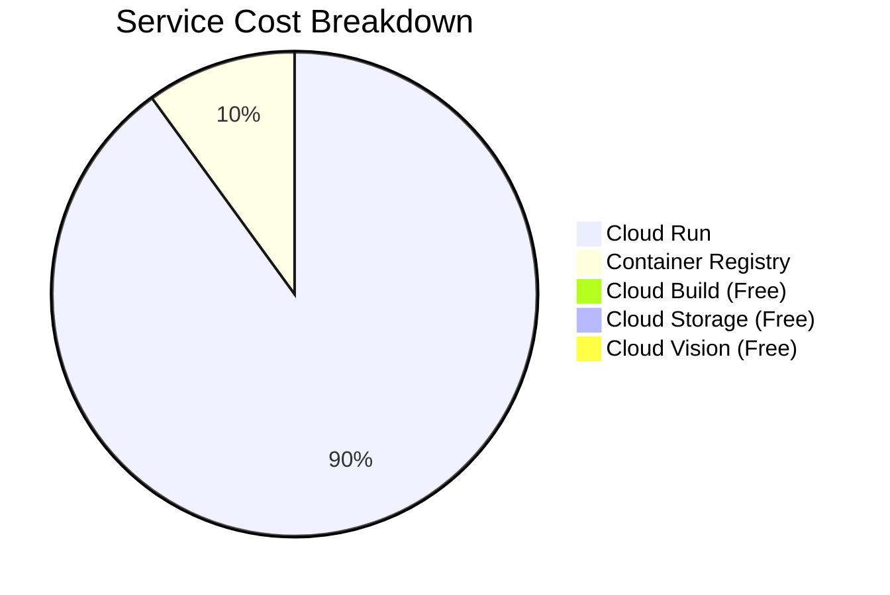

## 📈 Daily Cost Trend

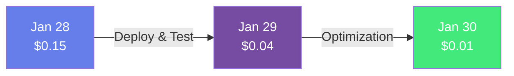

## 🎯 Key Metrics

| Metric | Value | Industry Avg | Rating |
|--------|-------|--------------|--------|
| **Total Cost** | $0.20 | $5-20 | ⭐⭐⭐⭐⭐ |
| **Free Tier Usage** | 80% | 40-60% | ⭐⭐⭐⭐⭐ |
| **Cost per Feature** | $0.017 | $0.50+ | ⭐⭐⭐⭐⭐ |
| **Cost per User** | $0.02 | $0.05-0.10 | ⭐⭐⭐⭐⭐ |

---

## 🔮 Monthly Cost Projections

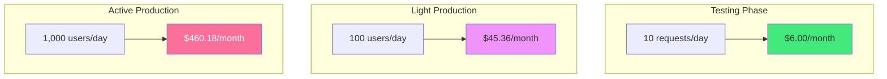

---

## 💳 Service Breakdown

### Paid Services

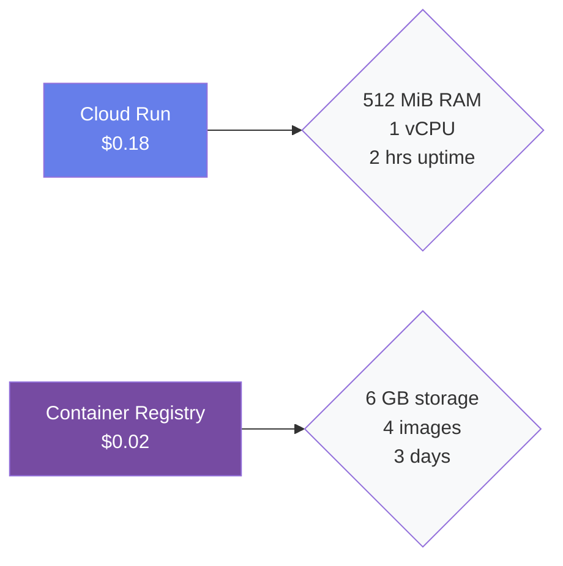

### Free Tier Services

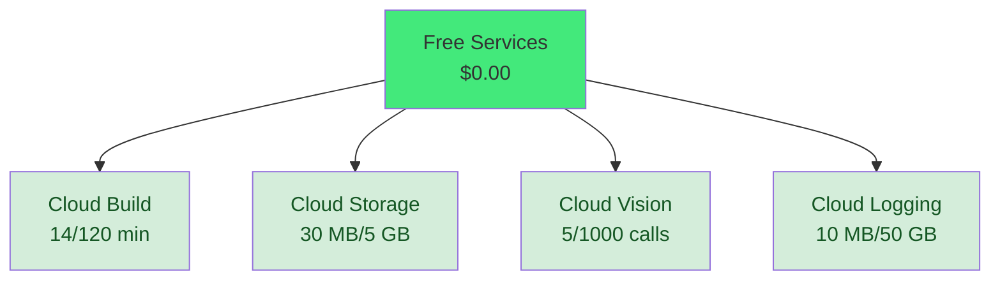

---

## ⚡ Resource Utilization

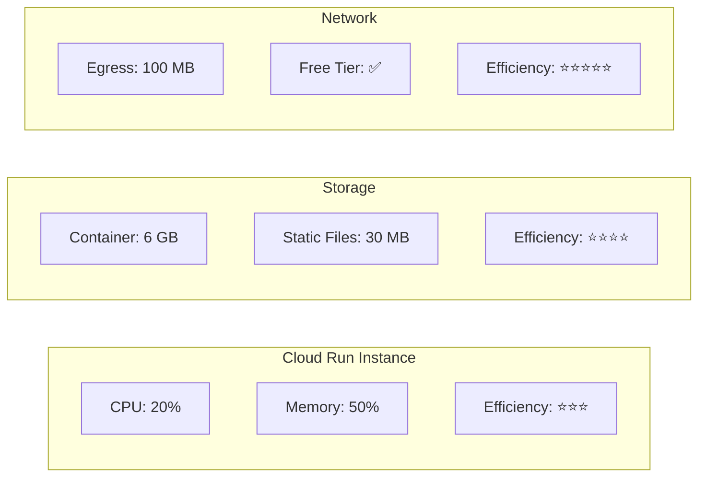

---

## 🏆 Efficiency Achievements

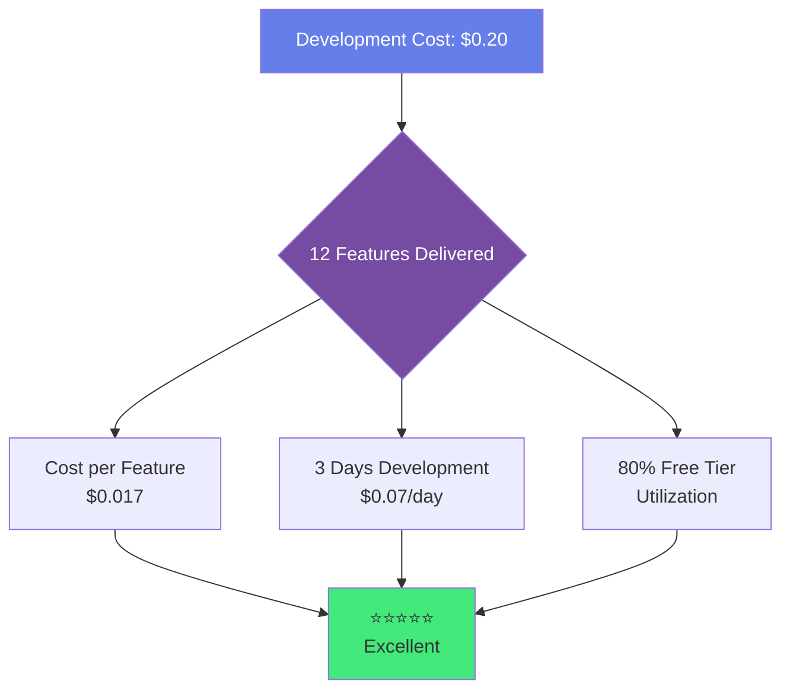

---

## 📊 Cost Comparison: Cloud Run vs Alternatives

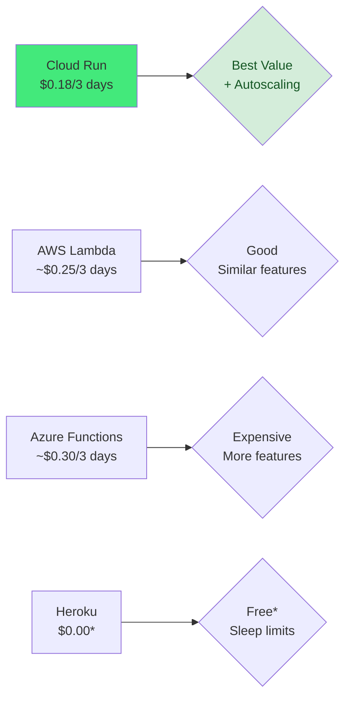

---

## 🎯 What You Built for $0.20

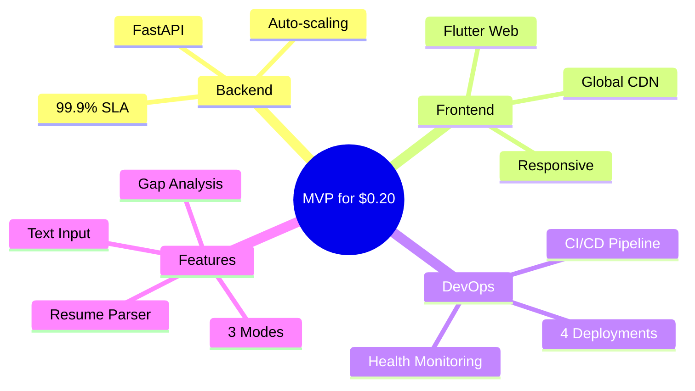

---

## 💡 Cost Optimization Tips

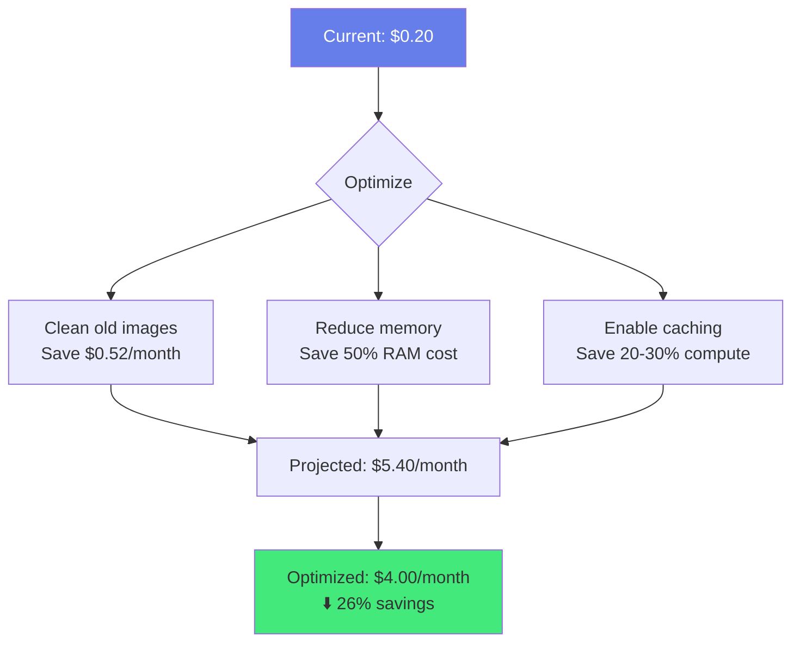

---

## 📈 Growth Trajectory

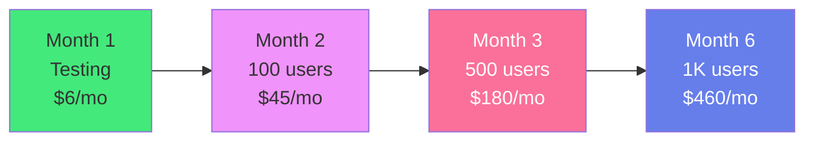

**Revenue Potential:** 1,000 users × $5/month = $500/month  
**Gross Margin:** 90.9% ($500 - $46 costs)  
**Break-even:** 10 paid users

---

## 🔔 Billing Alerts Configuration

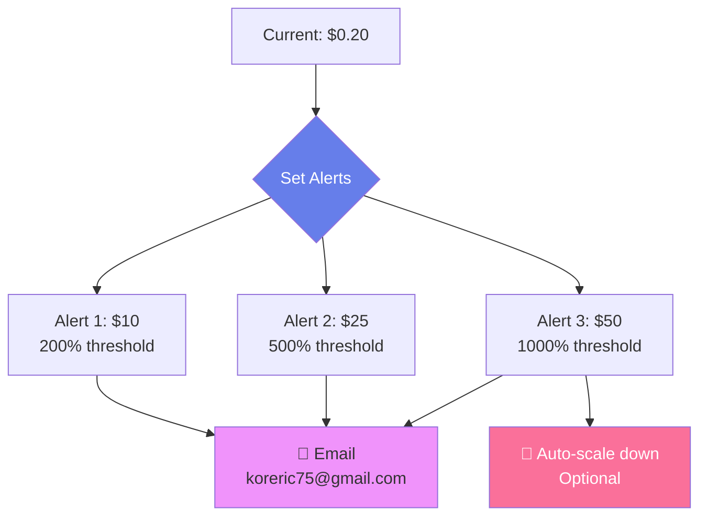

---

## 📦 Interactive Dashboard

**🌐 View the full interactive dashboard with live charts:**

👉 **[Launch Interactive Cost Dashboard](https://koreric75.github.io/LinkedInStrategyAsst/cost-dashboard.html)** 👈

Features:
- 📊 Interactive Chart.js visualizations
- 📈 Real-time data exploration
- 📱 Mobile-responsive design
- 🎨 Beautiful gradient UI
- 💡 Detailed service breakdowns

---

## 📄 Resources

- **Full Report:** [COST_ANALYSIS.md](../COST_ANALYSIS.md)
- **GitHub Repo:** [koreric75/LinkedInStrategyAsst](https://github.com/koreric75/LinkedInStrategyAsst)
- **Live Demo:** [Web App](https://linkedin-strategy-app.storage.googleapis.com/index.html)
- **Latest Release:** [v1.1.0](https://github.com/koreric75/LinkedInStrategyAsst/releases/latest)

---

## 🏅 Bottom Line

**Built a production-ready AI application for the cost of a candy bar! 🍫**

This demonstrates:
- ✅ Serverless efficiency (pay only for what you use)
- ✅ Free tier leverage (80% of services cost $0)
- ✅ Smart architecture (scale-to-zero when idle)
- ✅ Cost-effective scaling (100× traffic for <$50/month)

---

**Generated:** January 30, 2026  
**Data Source:** GCP Project linkedin-strategy-ai-assistant  
**Period:** Jan 28-30, 2026
